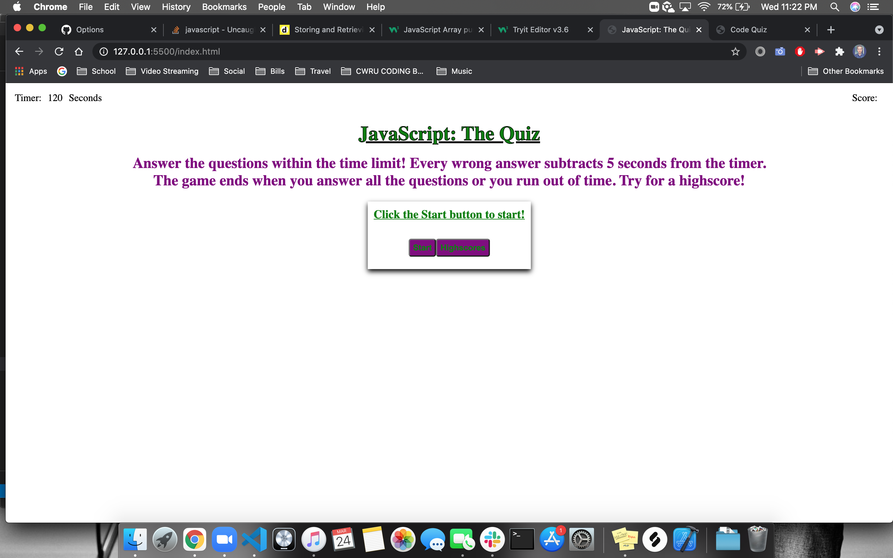
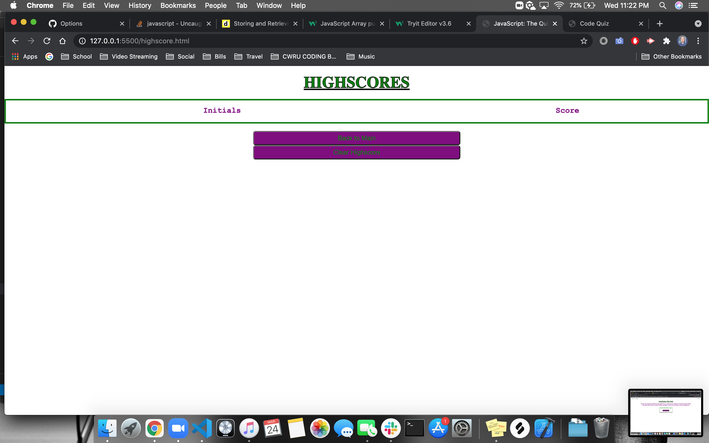

# JavaScript-The-Quiz
A timed quiz on the subject of JavaScript

## HTML
* This project has a basic HTML structure
* There are two separate HTML pages; One is the main quiz, the other, a highscore page.
* Most of the HTML is being generated in JavaScript.

## CSS
* There is a good amount of CSS in this project.
* There are also two CSS pages; One for the main quiz, and the other for the highscore page.
* I created a basic centered design with purple and green.
* I used flexbox for most of the layout.

## JavaScript
* This project is mainly JavaScript.
* The timer counts down and subtracts 10 seconds when a wrong answer is clicked, turning the answer red.
* +10 score is added when a right answer is clicked, turning the answer green.
* All the buttons work.
* The highscore page saves your initials and score.
* Music plays on start.
* When time runs out, or you cycle through the questions the game ends prompting you to enter your initials to save your score.
* Enjoy!

GitHub: https://github.com/beau4ta/JavaScript-The-Quiz

Live Page: https://beau4ta.github.io/JavaScript-The-Quiz/

